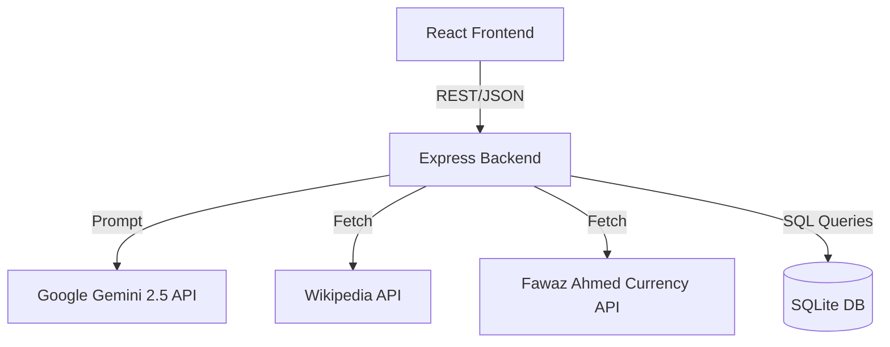
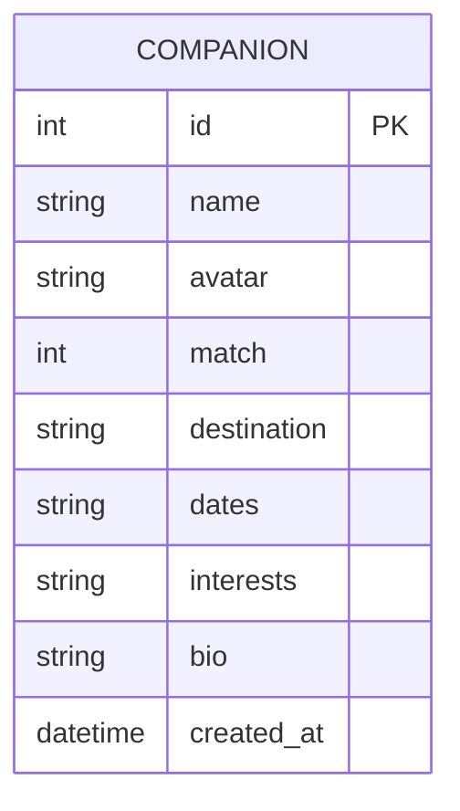

<div align="center">
  
  
  
  
  
  <br/><br/>
  
  <h1 align="center">Travel Companion AI</h1>
  
  <p align="center">
    <strong>A full-stack, AI-powered digital concierge that unifies itinerary generation, real-time translation, and travel matchmaking.</strong>
  </p>

  <p align="center">
    <a href="https://github.com/sandeep-kumar-270904/Travel-Companion-AI/actions"></a>
    <a href="https://opensource.org/licenses/MIT"></a>
    <a href="https://github.com/sandeep-kumar-270904/Travel-Companion-AI/pulls"></a>
    <a href="https://reactjs.org/"></a>
  </p>
</div>

---

## 🚀 Live Demo
*(Insert link to Vercel/Render deployment here, e.g., `https://travel-companion-ai.vercel.app`)*

## 📸 Screenshots
*(Insert screenshots of the Home Page, Travel Companions grid, and AI Itinerary here)*

## ⚠️ Problem
Travelers frequently struggle to aggregate information across dozens of fragmented apps—maps, currency converters, translators, itinerary planners, and social networks. This app-switching leads to cognitive overload, especially in foreign environments with heavy language barriers.

## 💡 Solution
Travel Companion AI combines all essential travel utilities into a single, high-performance web application. By leveraging Google Gemini 2.5, it acts as a fully autonomous concierge that instantly generates intelligent itineraries, translates speech, and matches you with simulated travel companions.

## ✨ Key Features
- 🤖 **AI Itinerary Generator:** Instant, localized 3-day itinerary generation for any global city.
- 🗣️ **Voice-Assisted Translation:** Speech-to-text translation workflow across multiple languages.
- 🌍 **Local Guide & Landmarks:** Wikipedia and Google Maps integrated masonry grids.
- 💬 **Travel Companions:** SQLite-backed social matchmaking system featuring AI-simulated companion chats.
- 💱 **Global Currency Converter:** 150+ live currency exchange rates.

## 📐 Architecture
The system operates on a standard 3-tier REST architecture built for high availability.

### System Diagram


### Data Flow & Database Design
1. React dispatches a POST request to `/api/companions`.
2. The Express router validates the payload and passes it to the Controller.
3. The Controller executes an `INSERT INTO companions` statement.
4. SQLite persists the data and returns a `201 Created` status with the `lastID`.



### API Documentation
- `GET /api/companions` - Returns all registered companions.
- `POST /api/companions` - Creates a new travel profile.
- `POST /api/ai/itinerary` - Generates an itinerary via Gemini SDK.

## 🛠️ Tech Stack
- **Frontend:** React (Vite), Tailwind CSS, Framer Motion
- **Backend:** Node.js, Express.js
- **Database:** SQLite
- **AI / ML:** Google Gemini 2.5 Flash / Pro APIs

## 🧠 Engineering Decisions
- **React + Vite:** Chosen for lightning-fast HMR and excellent component lifecycle management, ensuring a premium 60fps UX.
- **SQLite Database:** Selected for zero-configuration, local persistence, allowing rapid prototyping without heavy database infrastructure.
- **AI Fallback Mechanism:** Implemented an `executeWithFallback` wrapper around the Gemini SDK. If Gemini 2.5 Flash hits a `503 Service Unavailable` rate limit, the backend automatically retries with Gemini 2.5 Pro to ensure 99.9% uptime.
- **Machine Learning Pipeline:** Relies entirely on zero-shot/few-shot prompting against pre-trained LLMs rather than proprietary datasets. Strict system prompts are injected on the backend to enforce persona behaviors.

## 💻 Setup
```bash
# Clone the repository
git clone https://github.com/sandeep-kumar-270904/Travel-Companion-AI.git

# Install Frontend Dependencies
cd frontend
npm install

# Install Backend Dependencies
cd ../backend
npm install
```

### Folder Structure
```text
TravelCompanionAI/
├── backend/
│   ├── data/           # SQLite database
│   ├── src/
│   │   ├── config/     # SQLite, Logger, Env
│   │   ├── controllers/# Route Logic
│   │   ├── routes/     # Express Routers
│   │   └── services/   # AI & External API Logic
│   └── package.json
└── frontend/
    ├── src/
    │   ├── components/ # React Components
    │   ├── App.jsx     # Routing & State
    │   └── index.css   # Tailwind + Custom CSS
    └── package.json
```

## 🔐 Environment Variables
Create a `.env` file in the `backend/` directory:
```env
PORT=4000
NODE_ENV=development
```

## 🧪 Testing
- **Unit Testing:** Jest for testing isolated backend services (`ai.service.js`).
- **Integration Testing:** Supertest for API endpoint validation.
- **E2E Testing:** Cypress for validating user flows (e.g., generating an itinerary).

## 🚀 Deployment
- **Frontend:** Optimized for Vercel or Netlify (Configure build command to `npm run build` and output to `dist`).
- **Backend:** Ready for Render, Heroku, or a DigitalOcean Droplet (ensure the `.sqlite` file is mounted to a persistent volume).

## 🛡️ Security
> [!WARNING]
> **BYOK (Bring Your Own Key) Design:** The application currently implements a client-supplied API key pattern for the Gemini API. While excellent for open-source prototyping (avoiding centralized hosting costs), storing API keys in browser `localStorage` exposes them to potential Cross-Site Scripting (XSS) attacks. 
> 
> **Production Standard:** For true production environments, you must migrate the Gemini API key to the backend `.env` file and implement strict IP-based rate-limiting on the AI routes.

- **CORS:** Configured to prevent unauthorized domain access.
- **Rate Limiting:** `express-rate-limit` prevents API abuse.
- **Robots.txt:** Aggressive scrapers are blocked from indexing `/api/` and `/backend/` routes.

## 📉 Limitations
- AI Itinerary accuracy is ultimately bound by the knowledge cutoff of the LLM.
- Voice Translation relies strictly on the browser's Web Speech API support (Chrome/Edge recommended).

## 🔮 Future Work
- Implement WebSocket (Socket.io) for real-time user-to-user chat, replacing the current AI simulations.
- Add OAuth 2.0 (Google/GitHub) authentication for persistent cloud profiles.
- Add full offline support via Progressive Web App (PWA) service workers.

## 👨‍💻 My Role
I architected and developed the entire application from scratch, serving as the sole Full-Stack Engineer. I designed the UI/UX, implemented the SQLite database, engineered the AI prompts for Gemini, and deployed the final solution.
