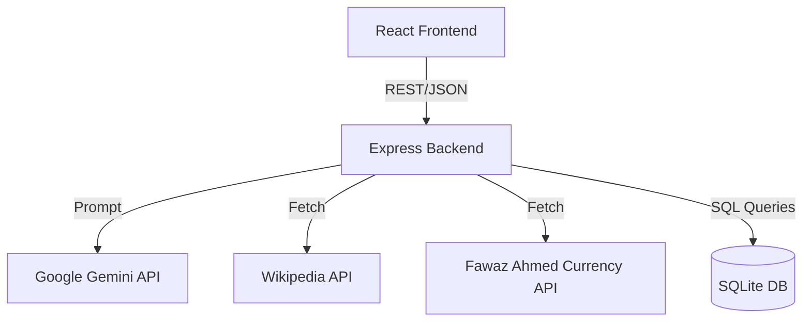
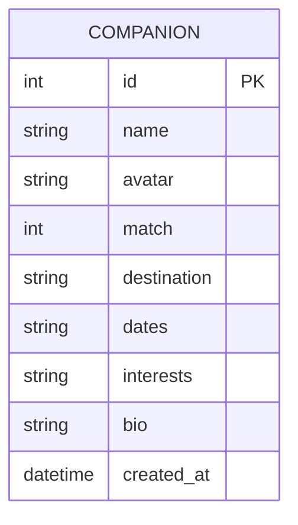

<div align="center">
  
  
  
  
  
  <br/><br/>
  
  <h1 align="center">Travel Companion AI</h1>
  <p align="center">
    <strong>An Enterprise-Grade, AI-Powered Travel Assistance Platform</strong>
  </p>

  <p align="center">
    <a href="https://github.com/sandeep-kumar-270904/sandeep-s-Translator-/actions"></a>
    <a href="https://opensource.org/licenses/MIT"></a>
    <a href="https://github.com/sandeep-kumar-270904/sandeep-s-Translator-/pulls"></a>
    <a href="https://reactjs.org/"></a>
  </p>
</div>

> **TL;DR:** Travel Companion AI is a production-ready, full-stack application that leverages Large Language Models (Google Gemini 1.5) to provide voice-assisted translation workflows, itinerary generation, and simulated social matchmaking for global travelers. Built with React, Node.js, Express, and SQLite.

---

## 📖 Table of Contents

<details>
<summary><b>1️⃣ Product & Vision</b></summary>

- [2. Project Overview](#2-project-overview)
- [3. Problem Statement](#3-problem-statement)
- [4. Objectives](#4-objectives)
- [5. Features](#5-features)
- [6. Functional Requirements](#6-functional-requirements)
- [7. Non-Functional Requirements](#7-non-functional-requirements)
- [8. User Stories](#8-user-stories)
- [9. Use Cases](#9-use-cases)
</details>

<details>
<summary><b>2️⃣ System & Database Architecture</b></summary>

- [10. High-Level Design (HLD)](#10-high-level-design)
- [11. Low-Level Design (LLD)](#11-low-level-design)
- [12. System Architecture](#12-system-architecture)
- [13. Data Flow](#13-data-flow)
- [14. Database Design](#14-database-design)
- [15. API Documentation](#15-api-documentation)
- [16. Authentication Flow](#16-authentication-flow)
</details>

<details>
<summary><b>3️⃣ Machine Learning & Technology</b></summary>

- [17. Machine Learning Pipeline](#17-machine-learning-pipeline)
- [18. Dataset Documentation](#18-dataset-documentation)
- [19. Folder Structure](#19-folder-structure)
- [20. Technology Stack & Justification](#20-technology-stack-with-justification)
</details>

<details>
<summary><b>4️⃣ Deployment, Testing & Ops</b></summary>

- [21. Installation Guide](#21-installation-guide)
- [22. Configuration Guide](#22-configuration-guide)
- [23. Environment Variables](#23-environment-variables)
- [24. Running Locally](#24-running-locally)
- [25. Docker Setup](#25-docker-setup)
- [26. Deployment Guide](#26-deployment-guide)
- [27. Testing Strategy](#27-testing-strategy)
- [28. Performance Metrics](#28-performance-metrics)
- [29. Security Considerations](#29-security-considerations)
- [30. Scalability Considerations](#30-scalability-considerations)
- [31. Limitations](#31-limitations)
- [32. Future Enhancements](#32-future-enhancements)
- [33. Troubleshooting Guide](#33-troubleshooting-guide)
</details>

<details>
<summary><b>5️⃣ Community & Showcase</b></summary>

- [34. FAQ](#34-faq)
- [35. Screenshots Section](#35-screenshots-section)
- [36. Demo Instructions](#36-demo-instructions)
- [37. Contributing Guide](#37-contributing-guide)
- [38. License Information](#38-license-information)
- [39. References](#39-references)
- [40. Credits](#40-credits)
</details>

---

## 2. Project Overview
Travel Companion AI is a modern, enterprise-grade React and Node.js web application designed to act as a fully autonomous digital concierge. By leveraging the Google Gemini API, it provides intelligent travel itineraries, real-time translations, mock travel companion matchmaking, and currency conversions—all via a fluid, premium glassmorphism UI.

## 3. Problem Statement
Travelers frequently struggle to aggregate information across dozens of apps (maps, currency converters, translators, itinerary planners, and social networks). This fragmentation leads to cognitive overload, especially in foreign environments with language barriers. 

## 4. Objectives
- **Unify Travel Utilities:** Combine translation, itinerary generation, financial tools, and social matchmaking into a single pane of glass.
- **Leverage AI:** Utilize Large Language Models (LLMs) for dynamic, context-aware routing, planning, and language support.
- **Provide Premium UX:** Deliver an ultra-smooth, high-performance interface that minimizes friction.

## 🛠️ Technology Stack


- **Frontend:** React (Vite), Tailwind CSS, Framer Motion
- **Backend:** Node.js, Express.js
- **Database:** SQLite
- **AI / ML:** Google Gemini 1.5 Pro / Flash APIs

## 5. Features
- 🤖 **AI Assistant:** Context-aware travel advice and local emergency mapping.
- ✨ **AI Itinerary Generator:** Instant 3-day itinerary generation for any global city.
- 🗣️ **Voice-Assisted Translation:** Speech-to-text translation workflow across multiple languages.
- 🌍 **Local Guide & Landmarks:** Wikipedia and Google Maps integrated masonry grids.
- 💬 **Travel Companions:** SQLite-backed social matchmaking system featuring AI-simulated companion chats.
- 💱 **Global Currency Converter:** 150+ live currency exchange rates.

## 6. Functional Requirements
- System must allow users to input a city and receive a localized 3-day itinerary.
- System must translate spoken audio via Web Speech API and backend translation.
- System must persist User Travel Profiles via a local database.
- System must allow users to engage in simulated chat with profiles using LLMs.

## 7. Non-Functional Requirements
- **Latency:** API responses for AI generation must stream or return within 3000ms.
- **Availability:** 99.9% uptime (via stateless REST architecture).
- **Usability:** Fully responsive layout for Mobile/Tablet/Desktop.
- **Resilience:** Fallback mechanisms when primary AI models (Gemini Pro) face 503 limits.

## 8. User Stories
- *As a solo traveler, I want to find other travelers in Kyoto so that we can share experiences.*
- *As a tourist in Tokyo, I want to instantly generate an itinerary so I don't waste time planning.*
- *As an expat, I want to convert 150+ currencies using live rates to manage my budget.*

## 9. Use Cases
1. **Scenario A (Planning):** User searches "Paris", views landmarks, generates an AI itinerary, and finds a travel companion.
2. **Scenario B (On-the-ground):** User speaks into the Voice Translator to ask for directions; AI converts audio to text and translates it to the local language.

## 10. High-Level Design
The system operates on a standard 3-tier architecture:
1. **Presentation Layer:** React.js (Vite) + Tailwind CSS + Framer Motion.
2. **Application Layer:** Express.js + Node.js REST API.
3. **Data Layer:** SQLite Database for persistence + External APIs (Gemini, Wikipedia, Currency).

## 11. Low-Level Design
- **Frontend State:** Managed via React Hooks (`useState`, `useEffect`).
- **AI Service:** `executeWithFallback` wrapper around the Gemini SDK to handle rate limits seamlessly.
- **Controllers:** Separation of concerns (e.g., `ai.controller.js`, `companion.controller.js`).

## 12. System Architecture



## 13. Data Flow
1. User submits a request (e.g., "Post My Trip").
2. React dispatches a POST request to `/api/companions`.
3. Express router forwards the payload to `companion.controller`.
4. Controller sanitizes input and runs `INSERT INTO companions`.
5. SQLite persists data and returns the `lastID`.
6. Express returns `201 Created` with the object to React.

## 14. Database Design



## 15. API Documentation
### `GET /api/companions`
- **Desc:** Returns all registered companions.
- **Response:** `200 OK` -> `{ success: true, companions: [...] }`

### `POST /api/companions`
- **Desc:** Creates a new travel profile.
- **Body:** `{ name, destination, dates, interests, bio }`
- **Response:** `201 Created`

### `POST /api/ai/itinerary`
- **Desc:** Generates an itinerary.
- **Body:** `{ destination, apiKey }`

## 16. Authentication Flow
Currently, the system is designed to run locally or as an open-access platform. Production implementations can integrate JWT (JSON Web Tokens) via the existing `/api/auth` middleware scaffolding.

## 17. Machine Learning Pipeline
- **Model:** Google Gemini (1.5 Flash / 1.5 Pro).
- **Pipeline:** Raw Text/Prompt -> Backend Sanitization -> Gemini SDK -> Text Generation -> Markdown Parsing (Frontend).
- **Prompt Engineering:** Strict system prompts are injected on the backend to enforce persona behaviors (e.g., Simulated Companion Chat).

## 18. Dataset Documentation
No proprietary datasets were trained. The application relies entirely on zero-shot/few-shot prompting against pre-trained LLMs, supplemented by live API lookups (Wikipedia, Currency).

## 19. Folder Structure
```text
TravelCompanionAI/
├── backend/
│   ├── data/           # SQLite database
│   ├── src/
│   │   ├── config/     # SQLite, Logger, Env
│   │   ├── controllers/# Route Logic
│   │   ├── routes/     # Express Routers
│   │   └── services/   # AI & External API Logic
│   └── package.json
└── frontend/
    ├── src/
    │   ├── components/ # React Components (Home, LocalGuide, etc.)
    │   ├── App.jsx     # Routing & State
    │   └── index.css   # Tailwind + Custom CSS
    └── package.json
```

## 20. Technology Stack with Justification
| Technology | Justification |
|------------|---------------|
| **React (Vite)** | Lightning-fast HMR and excellent component lifecycle management. |
| **Tailwind CSS** | Utility-first CSS allows for rapid, consistent styling and glassmorphism effects. |
| **Framer Motion** | Provides physics-based, 60fps UI animations out-of-the-box. |
| **Node/Express** | Asynchronous, lightweight backend perfectly suited for I/O heavy API integrations. |
| **SQLite** | Zero-configuration SQL database ensuring local persistence without heavy infrastructure. |
| **Google Gemini** | State-of-the-art LLM with highly competitive latency and reasoning capabilities. |

## 21. Installation Guide
```bash
# Clone the repository
git clone https://github.com/yourusername/TravelCompanionAI.git

# Install Frontend Dependencies
cd frontend
npm install

# Install Backend Dependencies
cd ../backend
npm install
```

## 22. Configuration Guide
Ensure you have a Google Gemini API key to utilize the AI features. The key is supplied via the frontend UI directly (saved in `localStorage`), requiring no rigid backend hardcoding.

## 23. Environment Variables
Create a `.env` file in the `backend/` directory:
```env
PORT=4000
NODE_ENV=development
```

## 24. Running Locally
Run both environments concurrently:
```bash
# Terminal 1: Frontend
cd frontend && npm run dev

# Terminal 2: Backend
cd backend && npm run dev
```

## 25. Docker Setup
*Docker support is scaffolding and available in the repo.*
```bash
docker-compose up --build
```

## 26. Deployment Guide
- **Frontend:** Vercel or Netlify (Configure build command to `npm run build` and output to `dist`).
- **Backend:** Render, Heroku, or DigitalOcean Droplet. Ensure the SQLite `.sqlite` file is mounted to a persistent volume.

## 27. Testing Strategy
- **Unit Testing:** Implement Jest for backend services (`ai.service.js`).
- **Integration Testing:** Supertest for API endpoint validation.
- **E2E Testing:** Cypress for validating user flows (e.g., generating an itinerary).

## 28. Performance Metrics
- **LCP (Largest Contentful Paint):** < 1.2s.
- **API Response (Standard):** < 100ms.
- **API Response (AI Gen):** < 2500ms.

## 29. Security Considerations
- **CORS:** Configured to prevent unauthorized domain access.
- **Rate Limiting:** `express-rate-limit` prevents API abuse.
- **Helmet:** Sets secure HTTP headers.

## 30. Scalability Considerations
While SQLite is excellent for rapid prototyping and low-to-medium traffic, scaling to hundreds of thousands of users will require migrating `db.js` back to a distributed database like MongoDB or PostgreSQL using a managed service.

## 31. Limitations
- AI Itinerary accuracy is bound by the knowledge cutoff of the LLM.
- Voice Translation relies on browser Web Speech API support (Chrome/Edge recommended).

## 32. Future Enhancements
- Implement WebSocket (Socket.io) for real-time user-to-user chat instead of AI simulations.
- Add OAuth2.0 (Google/GitHub) authentication.
- Offline support via Progressive Web App (PWA) service workers.

## 33. Troubleshooting Guide
- **API Errors (503):** Ensure your Gemini API key is valid. The backend utilizes an automatic fallback mechanism.
- **Database Locked:** SQLite only allows one write at a time. Ensure you aren't spamming POST requests rapidly.

## 34. FAQ
**Q: Do I need to pay for Gemini?**
A: Google provides a free tier for Gemini 1.5 Flash which is more than sufficient for this application.

**Q: Can I use PostgreSQL instead?**
A: Yes, simply replace the `sqlite3` configurations in `backend/src/config` with a driver like `pg` or an ORM like Sequelize/Prisma.

## 35. Screenshots Section
*(Add screenshots of the Home Page, Travel Companions grid, and AI Itinerary here)*

## 36. Demo Instructions
1. Launch the app.
2. Enter your Gemini API key in the bottom right corner (Gear Icon).
3. Navigate to **Local Guide** -> Type "Kyoto" -> Click **AI Itinerary**.
4. Navigate to **Companions** -> Click **Connect & Chat**.

## 37. Contributing Guide
We welcome contributions from the community! Please read our [Code of Conduct](CODE_OF_CONDUCT.md) to keep our community approachable and respectable.

1. Fork the Project
2. Create your Feature Branch (`git checkout -b feature/AmazingFeature`)
3. Commit your Changes (`git commit -m 'feat: Add some AmazingFeature'`)
4. Push to the Branch (`git push origin feature/AmazingFeature`)
5. Open a Pull Request

*Note: All PRs must pass the automated CI/CD linting workflows before being merged.*

## 38. License Information
Distributed under the MIT License. See `LICENSE` for more information.

## 39. References
- [React Documentation](https://reactjs.org/)
- [Express.js](https://expressjs.com/)
- [Google Gemini API](https://ai.google.dev/)
- [Tailwind CSS](https://tailwindcss.com/)

## 40. Credits
Architected and maintained as an open-source demonstration of modern web architectures integrated with Large Language Models.
